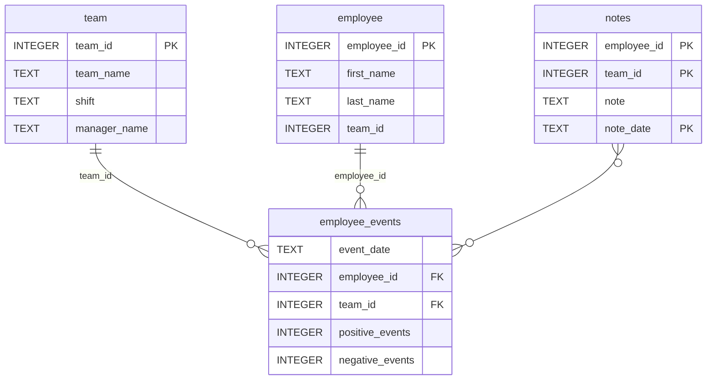

# Employee Performance Dashboard
**Author:** Jose Daniel Gutierrez  
**Course:** Software Engineering for Data Scientists — Udacity Nanodegree

A full-stack data science project that monitors employee performance and predicts recruitment risk using machine learning.

## Features
- Interactive dashboard built with FastHTML + dark mode UI
- ML model predicting employee recruitment risk with color-coded visualization
- Python package with SQL query API for the `employee_events` database
- Automated tests with pytest + GitHub Actions CI/CD

## How to run locally
```bash
# 1. Create and activate virtual environment
python -m venv env
env\Scripts\activate  # Windows

# 2. Install dependencies
pip install -r requirements.txt

# 3. Install the Python package
cd python-package
pip install -e .
cd ..

# 4. Run the dashboard
cd report
python dashboard.py
# Open http://localhost:5001
```

## Run tests
```bash
pytest tests/
```
# Software Engineering for Data Scientists 

This repository contains starter code for the **Software Engineering for Data Scientists** final project. Please reference your course materials for documentation on this repository's structure and important files. Happy coding!

### Repository Structure
```
├── README.md
├── assets
│   ├── model.pkl
│   └── report.css
├── env
├── python-package
│   ├── employee_events
│   │   ├── __init__.py
│   │   ├── employee.py
│   │   ├── employee_events.db
│   │   ├── query_base.py
│   │   ├── sql_execution.py
│   │   └── team.py
│   ├── requirements.txt
│   ├── setup.py
├── report
│   ├── base_components
│   │   ├── __init__.py
│   │   ├── base_component.py
│   │   ├── data_table.py
│   │   ├── dropdown.py
│   │   ├── matplotlib_viz.py
│   │   └── radio.py
│   ├── combined_components
│   │   ├── __init__.py
│   │   ├── combined_component.py
│   │   └── form_group.py
│   ├── dashboard.py
│   └── utils.py
├── requirements.txt
├── start
├── tests
    └── test_employee_events.py
```

### employee_events.db


